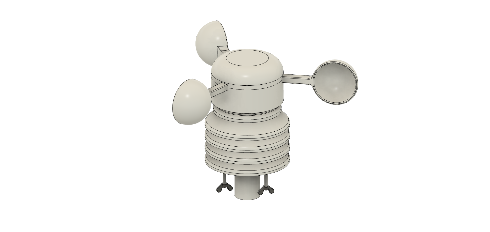

# Open Weather Station

Open-source, low-cost weather station designed for remote astronomical observatories

## Overview

A complete weather monitoring solution built specifically for astronomical observatories and remote telescope installations. This project provides everything needed to build and deploy a professional-grade weather station at a fraction of commercial costs.

Originally developed to support the ROTSE-III Namibia telescope revival project, but designed as a general-purpose solution for the global astronomy community.

## Features

- **Comprehensive Sensor Suite**: Temperature, humidity, barometric pressure, wind speed.
- **3D Printable Design**: Weatherproof enclosure and mounting hardware
- **Remote Monitoring**: Web interface with real-time data display
- **Data Logging**: CSV/JSON export with API access
- **Solar Power Ready**: Designed for off-grid installations
- **Robust Construction**: Built to withstand harsh outdoor environments

## Hardware Design

The weather station features a modular design with a weatherproof 3D printed enclosure. All components are easily accessible for maintenance while providing excellent protection against the elements.

## Quick Start

1. **Hardware**: Print the enclosure parts and assemble with components from the BOM
2. **Software**: Flash the firmware and configure your WiFi settings
3. **Deploy**: Mount securely and connect to your observatory network
4. **Monitor**: Access the web interface for real-time data and historical logs

## Repository Structure

- `hardware/` - 3D models, electronics schematics, and assembly instructions
- `software/` - Firmware, web interface, and calibration tools
- `docs/` - Detailed assembly guide, setup instructions, and troubleshooting
- `examples/` - Sample configurations and data outputs

## Getting Started

See the [Assembly Guide](docs/assembly-guide.md) for detailed build instructions and the [Software Setup](docs/software-setup.md) guide for firmware installation.

## License

This project is open source. See [LICENSE](LICENSE) for details.

## Acknowledgments

This project was developed to support the revival of the ROTSE-III telescope network and is dedicated to making low cost professional-grade weather monitoring accessible to observatories worldwide.

---

⭐ If this project helps your observatory, please consider starring the repository!
