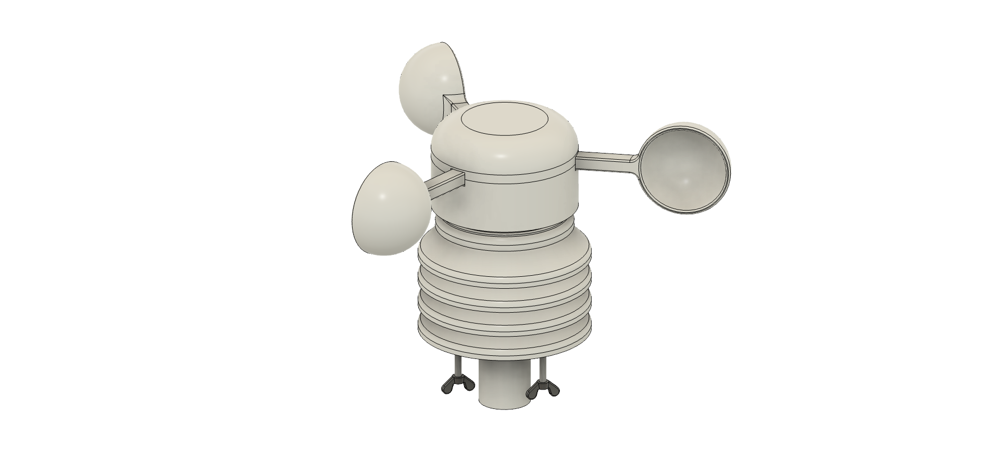

# Weather Station Assembly Guide

*Complete hardware and electronics assembly instructions for the Open Observatory Weather Station*


## Bill of Materials

### 3D Printed Parts
- 1x Base
- 1x Roof  
- 1x Sensor Holder
- 4x Radiation Screens
- 1x Rotor
- 1x Rotor Cap
- 3x Cup 
- 12x Tall spacer
- 3x Short spacer

### Hardware Components
- 1x M8 x 16 Steel hex head bolt
- 1x M8 Nut
- 3x M4 Steel wing nuts
- 3x Steel rod M4 (10cm length)
- 1x Ball bearing (permanently lubricated)
- 3x Neodymium magnets (5x5mm)

### Electronics
- 1x Raspberry Pi Pico
- 1x AHT20 + BMP280 Temperature, Humidity, and Pressure Module
- 1x Hall Effect Sensor A3144 
- MicroUSB cable for programming
- 2x XH2.54 4P Male Connector (Recommended)
- 2x XH2.54 4P Female Connector (Recommended)
- 1x Double Side Prototype PCB Universal Printed Circuit Board (3x7cm) (Recommended)
- 4m 6-core cable (Recommended)

## Tools Required
- 3D printer (PLA or PETG recommended)
- Soldering iron and solder
- Wire strippers
- Small screwdriver set
- Drill with small bits
- Multimeter (for testing)

## Assembly Instructions

### Step 1: Rotor Assembly


### Step 2: Roof


### Step 3: Body


### Step 4: Finish 




### Step 5: Electronics Assembly


1. **Prepare the Raspberry Pi Pico**:
   - Install MicroPython or CircuitPython firmware
   - Test basic functionality before installation

2. **Connect the BMP280 sensor**:
   ```
   BMP280 -> Pi Pico
   VCC    -> 3.3V
   GND    -> GND
   SCL    -> GP1 (I2C)
   SDA    -> GP0 (I2C)
   ```


*[Image suggestion: Photo showing BMP280 sensor wired to Pi Pico with colored wires]*

3. **Wire the Hall effect sensor**:
   ```
   Hall Sensor -> Pi Pico
   VCC        -> 3.3V
   GND        -> GND
   OUT        -> GP2 (Digital input)
   ```


*[Image suggestion: Photo of Hall effect sensor with wiring connections clearly visible]*

4. **Position the Hall effect sensor**:
   - Mount the sensor near the rotor magnet path
   - Ensure it detects magnet passes without interference
   - Test rotation detection before final assembly


*[Image suggestion: Photo showing Hall sensor positioned relative to rotating magnet path]*
